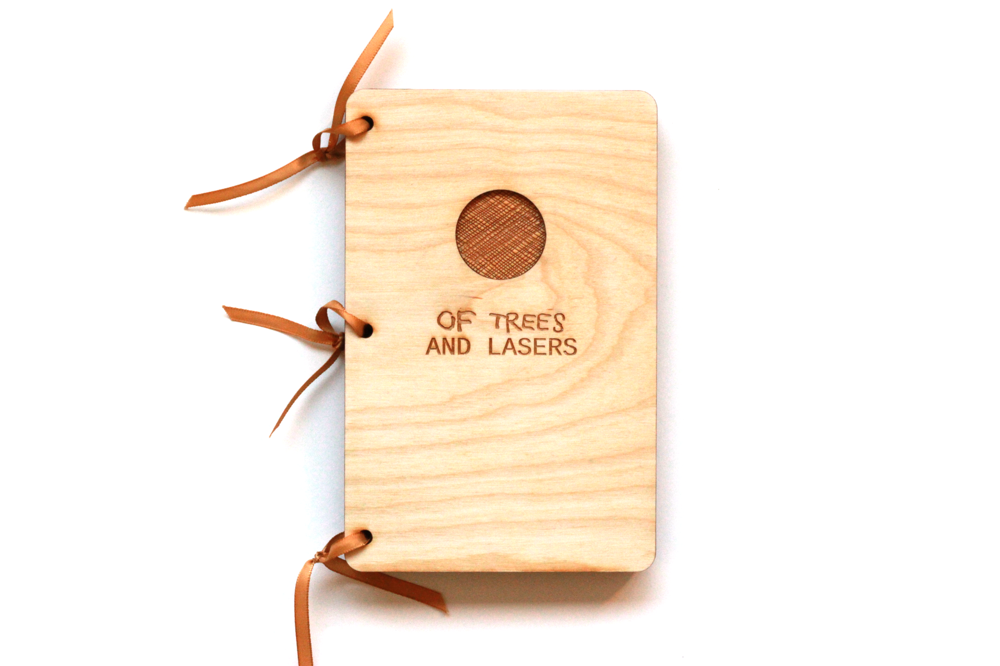
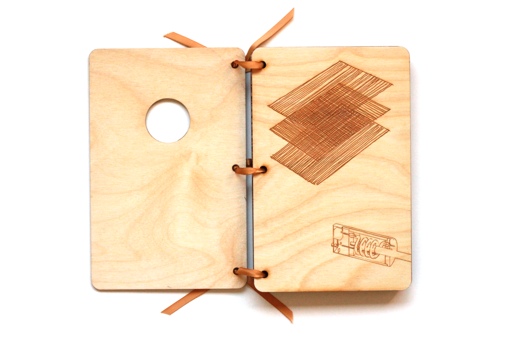
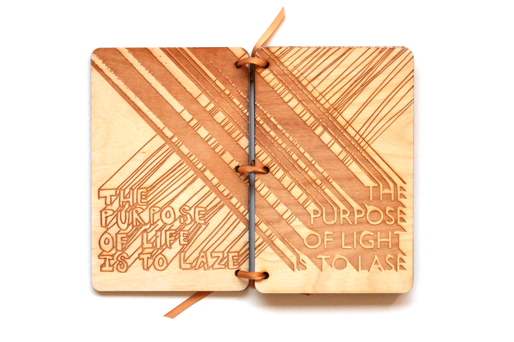
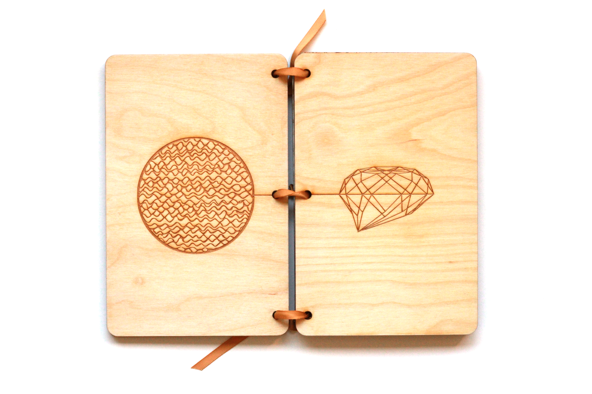
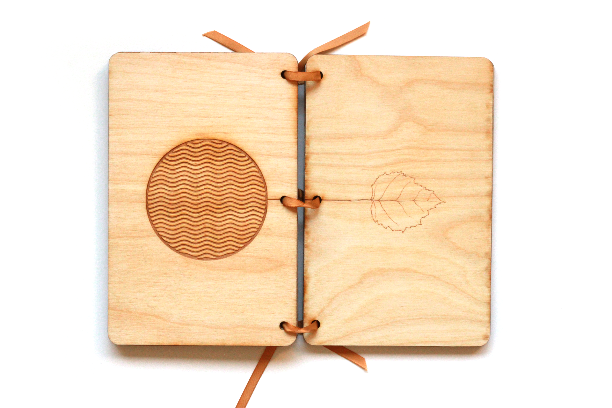
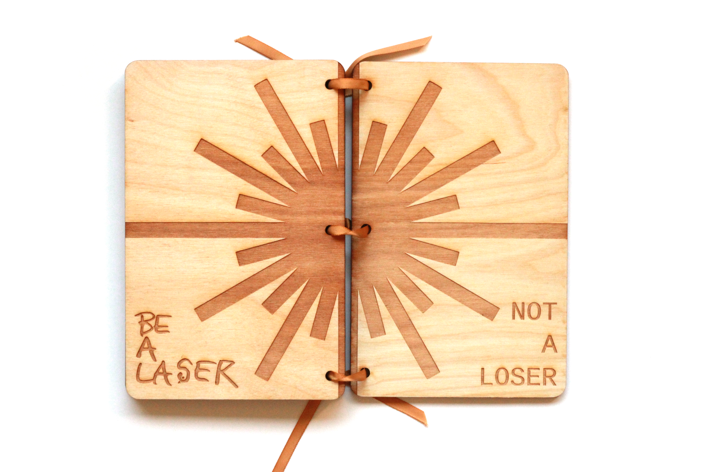
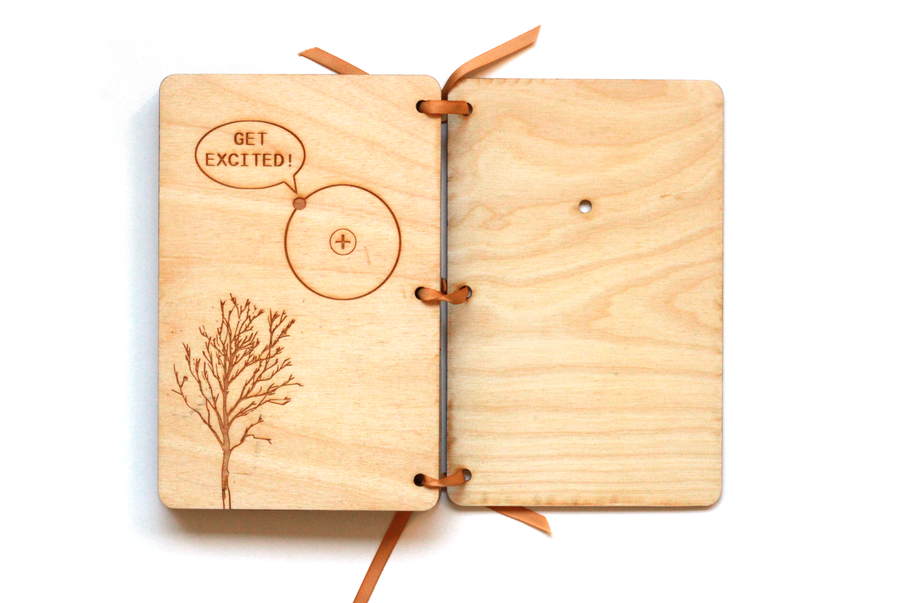
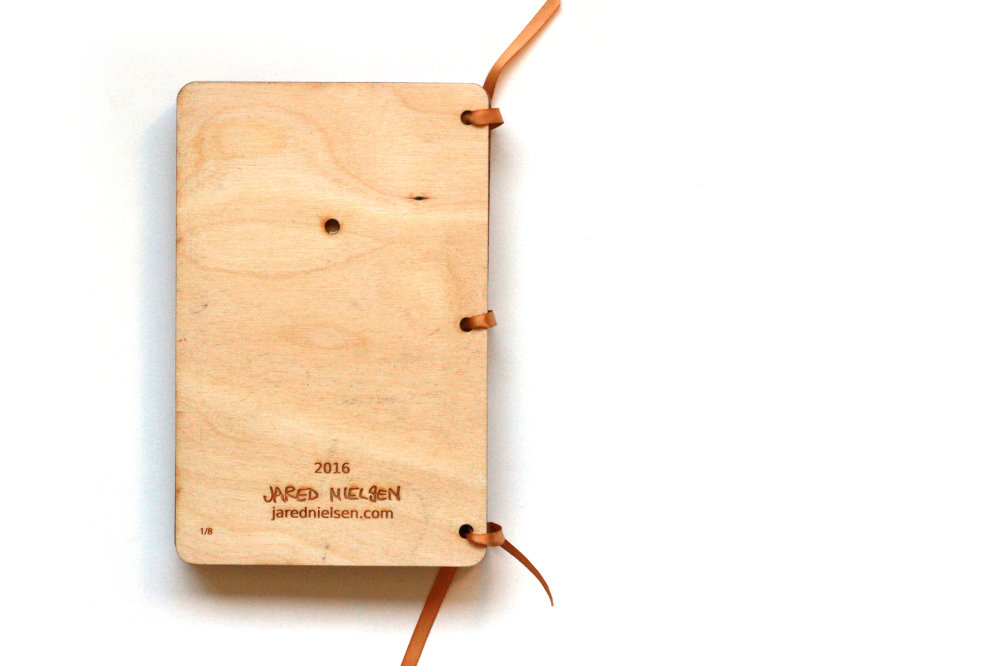

# Of Trees and Lasers

_Of Trees and Lasers_ is a book I made using the laser cutter in the Fablab at the Martin Luther King, Jr. branch of the District of Columbia Public Library. Read more about the design and build process [here](https://medium.com/@jarednielsen/how-to-make-a-laser-cut-plywood-book-a19bef7cdebc).

